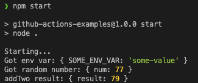

# GitHub Actions Examples

This repo contains a basic Node.JS function built in TypeScript. It includes 2
entrypoints: 1 for Docker, and 1 for AWS Lambda.

We're running this in Node LTS v18 because that's the most recent version
available in AWS Lambda.

## Table of Contents

- [Setup (local)](#setup-local)
- [Running locally](#running-locally)
- [Setup AWS Lambda](#setup-aws-lambda)
- [Deploying to AWS Lambda](#deploying-to-aws-lambda)
- [Improvements](#improvements)

## Setup (local)

1. Run `npm install`
    > [!NOTE]
    > Make sure you're running Node v18

## Running locally

1. Duplicate the `.env.example` file to `.env`
1. Compile the TypeScript: `npm run build`
1. Run the function: `npm start`

    

## Setup AWS Lambda

Each environment will need its own Lambda function. For this example, we
have 2 environments: "dev" and "prod".

1. Install the AWS CLI
1. Create an IAM user and get the access key and secret key
1. Set the following secrets in the GitHub:
    - `AWS_ACCESS_KEY_ID` - IAM access key
    - `AWS_SECRET_ACCESS_KEY` - IAM secret key
    - For more information on creating secrets for GitHub Actions, see "[Using secrets in GitHub Actions.](https://docs.github.com/en/actions/security-guides/using-secrets-in-github-actions#creating-secrets-for-a-repository)"
1. Follow the steps in "[Setup for all AWS](#setup-for-all-aws)"
1. Figure out which AWS Region you want to deploy to
    - For this example, we're using `us-east-2`
    - You can change this in the
    [Lambda Deploy Workflow file](`.github/workflows/deploy-lambda.yml`)
1. Create 2 Node.JS Lambda functions named `gh-actions-lambda-dev` and
`gh-actions-lambda-prod` in the AWS region from the previous step.

## Deploying to AWS Lambda

1. Make a commit
1. Create a Pull Request into one of the `deploy/lambda/xxx` branches
    - Either `deploy/lambda/dev` or `deploy/lambda/prod` depending on which
    environment you want to deploy to
1. Merge the PR
1. The GitHub action will start running
